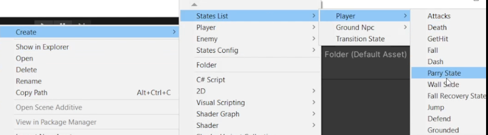

# Unity All Purpose State Machine (SOLID Friendly)

A flexible, extensible, SOLID‑oriented state machine system for Unity.
Designed so any GameObject can run a clean, context‑driven state machine with minimal setup.

This README explains what the system is, how it works under the hood, and how to use it step by step.
Image and GIF placeholders are included with instructions on what they should show.

---

## Overview

This system uses:

* A **StateMachine** MonoBehaviour that runs your states.
* A **Context** script that holds all values, data, and behaviors relevant to the object.
* A **ScriptableObject StateList**, which stores all possible states for this object.
* **State scripts** that all inherit from a `BaseState` class. States can also inherit from each other to form hierarchical or tree‑like structures.

This follows SOLID principles by separating responsibilities clearly:

* The StateMachine only manages transitioning and executing.
* Each State handles one state's logic.
* The Context knows the data of the character/object.
* The ScriptableObject holds configuration, not behaviors.

---

## System Architecture

### StateMachine (MonoBehaviour)

This component lives on your GameObject and handles:

* Tracking the current state
* Initializing all states
* Updating the active state
* Changing states

**Image placeholder:**

`[Insert image of the StateMachine component in the Unity Inspector]`
*The picture should show the GameObject with the StateMachine component, the reference to the Context script, and the assigned StateList ScriptableObject.*

### Context

A separate script inheriting from `Context`.
Holds values like:

* Animator
* References to other components
* Flags or booleans

**Image placeholder:**

`[Insert image of a custom Context script attached to the same GameObject]`
*Show custom exposed fields like speed, jumpForce, animator reference.*

---

## StateList (ScriptableObject)

A ScriptableObject used as a dictionary mapping a **State Enum** to a **State Script**.

**GIF placeholder:**

`[Insert GIF showing creation of a StateList ScriptableObject via Right‑click > Create > StateList]`
*Show the inspector view where states are added, each with their enum assignment.*

---

## States

Each state is a class inheriting from `BaseState`.
You can also inherit states from each other to form a behavior tree.

Common example methods:

* `Enter()`
* `Update()`
* `Exit()`

**Image placeholder:**

`[Insert image of folder structure: BaseState.cs, IdleState.cs, MoveState.cs, AttackState.cs, etc.]`

**Optional GIF placeholder:**

`[Insert GIF demonstrating switching between states in Play Mode using Debug logs or UI]`

---

## How to Use

### 1. Add the StateMachine

Add the `StateMachine` component to your GameObject.

### 2. Add Your Context Script

Create a custom context script inheriting from `Context`.
Attach it to the same GameObject.

Example:

```csharp
public class PlayerContext : Context {
    public float moveSpeed;
    public Animator animator;
}
```

### 3. Create a StateList ScriptableObject

Right click in your project window:
**Create > StateMachine > StateList**
Assign all your states into the list and give each one its enum.

### 4. Create Your States

Each state must inherit from `BaseState`.
Example:

```csharp
public class IdleState : BaseState {
    public override void Enter(Context context) {
        // Start idle animation
    }
    public override void Update(Context context) {
        // Check for movement input
    }
    public override void Exit(Context context) {
        // Cleanup
    }
}
```

### 5. Assign Everything

In the StateMachine Inspector:

* Assign your Context component
* Assign the StateList ScriptableObject
* Choose default state

### 6. Add Context Values and Tweaks

Open your custom Context script fields in the inspector and fill in your gameplay values.

---

## Benefits

* Follows SOLID principles
* Fully reusable across projects
* Easy to expand with new states
* Supports inheritance chains for complex behavior
* Clean separation of data vs behavior vs transitions

---

## License
opyright (c) 2025 Haithem Elhadj

Permission is hereby granted, free of charge, to any person obtaining a copy of this software and associated documentation files (the “Software”), to deal in the Software without restriction, including without limitation the rights to use, copy, modify, merge, publish, distribute, sublicense, and/or sell copies of the Software, and to permit persons to whom the Software is furnished to do so, subject to the following conditions:

The above copyright notice and this permission notice shall be included in all copies or substantial portions of the Software.

THE SOFTWARE IS PROVIDED “AS IS”, WITHOUT WARRANTY OF ANY KIND, EXPRESS OR IMPLIED, INCLUDING BUT NOT LIMITED TO THE WARRANTIES OF MERCHANTABILITY, FITNESS FOR A PARTICULAR PURPOSE AND NONINFRINGEMENT. IN NO EVENT SHALL THE AUTHORS OR COPYRIGHT HOLDERS BE LIABLE FOR ANY CLAIM, DAMAGES OR OTHER LIABILITY, WHETHER IN AN ACTION OF CONTRACT, TORT OR OTHERWISE, ARISING FROM, OUT OF OR IN CONNECTION WITH THE SOFTWARE OR THE USE OR OTHER DEALINGS IN THE SOFTWARE.

